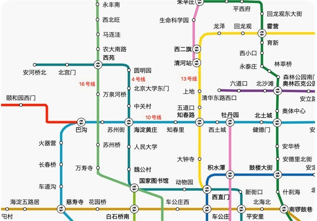

## 前言

Intel 北京有两个 site，分别是位于东城区环球贸易中心（简称 GTC ）和海淀区融科资讯中心（简称 RYC）。

* GTC 地址：北京市东城区北三环东路36号2号楼环球贸易中心D座20层
* RYC 地址：北京市海淀区科学院南路2号融科资讯中心A座8层

部门位于 RYC，紧靠北四环，与北大清华隔环相望。

 

RYC 紧邻北四环，与北大清华隔环相望，附近又被一众名校包围，并且随着互联网大厂的房补一再提高，附近区域的房价也随着水涨船高，一定程度上可以说是北京 top 难租之一了。

下面整理下个人及周围同事长期以来的租房经验，希望能给大家提供些便利。相信只要遵循“提前，多找，多看”的原则，一定能找到适合自己符合期望的“小窝”的。

## 一、沿地铁线（4号线、3号线、10号线）

对于大部分人来说，地铁线是北京出勤最方便的方式。这里图片的范围应该是可以覆盖到 30~60分钟左右的出勤时间（排除其他个人因素）。公司附近比较方便的地铁站有两个：海淀黄庄站和中关村站。一个向南一个向西，距离大致相同。

沿着 4 号线一般都要从西苑站换乘 16 号线继续向北，在农大南路、马连洼相邻的几站附近小区挺多，包括肖家河新区、圆明园花园、梅园、百草园等。一般合租三居室价位在 2500~3500 不等，具体要看房间的朝向，面积以及公共卫生间个数等。如下图所示是从自如找房截图所得，可以达到一个大致的价格。

沿着 16 号线再继续往北要到西北旺附近，那边互联网大厂云集，丰厚的房补也随之拉高周围的租房价格，大家可以找下看看，没有特别关注。

如果从公司一直向南坐 10 号线再转 13 号线，租房的目标便落到了上地和回龙观附近。附近公司很多，小区也同样很多，价位和马连洼接近，如融泽嘉园以及回龙观新村、龙泽苑等。

如果沿着 4 号线往南，中间 4 站以内价格普遍偏高，如下图所示，中间不乏整租和 2 居室的，大家可以根据需要自行过滤来查看。需要注意的是有些房间价格对比周围可能低很多，很可能是挨着路边或者地铁线。如果是第一次租房的童鞋最好去现场踩下点，看自己是否能够接受晚上的噪音。根据我租房的经验，主干路的车流噪声基本是全天无休的，如果窗户或者房间隔音很差，会严重影响休息。

继续向南在国家图书馆站，北京动物园左右，虽然小区相比前面几站多了许多，但价位却居高不下，平均在 3000 左右，主要是因为附近几处地点的缘故，如北航，北京动物园以及北京建筑大学等。

## 二、沿公交线路查找

686 路公交

to be updated
